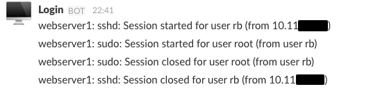

## L2S

Logins to Slack. A simple PAM script that sends notifications to Slack at the beginning and end of a login session.

&nbsp;&nbsp;&nbsp;&nbsp;

Currently there is only support for Debian. Other Debian derived distros might work out-of-the-box but have not been tested. Pull requests for wider support are welcome.

### Installation & usage

Run `make` to build the Debian package. Once installed configure the reported hostname and the incoming webhook url for Slack in `/etc/l2s.conf`:

```
[l2s]
host     = webserver1
services = sshd,sudo,su
botname  = Login
icon     = :desktop_computer:
url      = https://slack.hooks.url/something/something
```

That's it for Debian 8. For Debian 7, append the following line to both `/etc/pam.d/common-session` and `/etc/pam.d/common-session-noninteractive`:

```
session optional pam_script.so
```

### Disclaimer

Slack should not be used in place of a real audit log. This script was merely made for convenience. Messages to Slack are easily forged if the webhook URL is known and there is no redundancy handling in place should the Slack API endpoint be down.

### License

BSD 2-Clause. See the LICENSE file for details.
